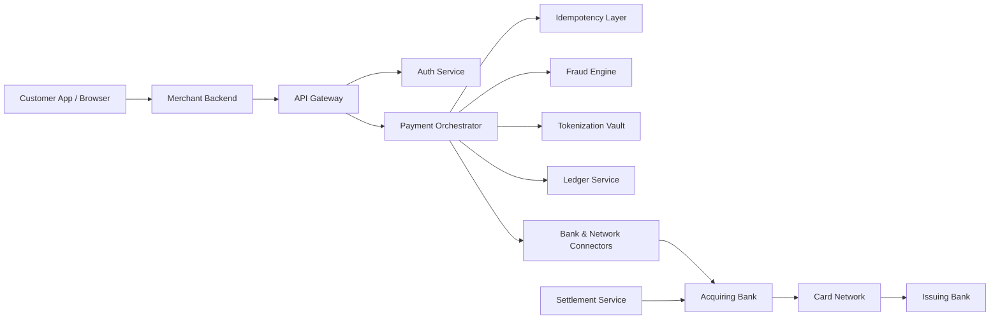
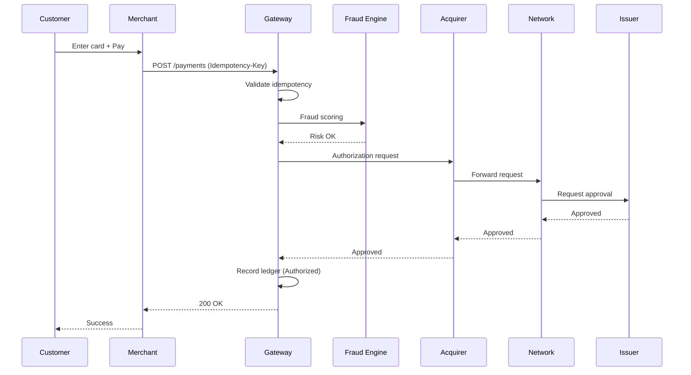
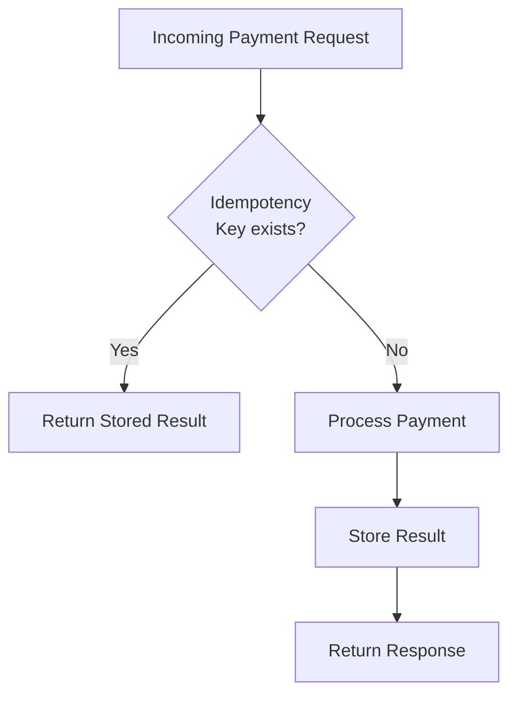
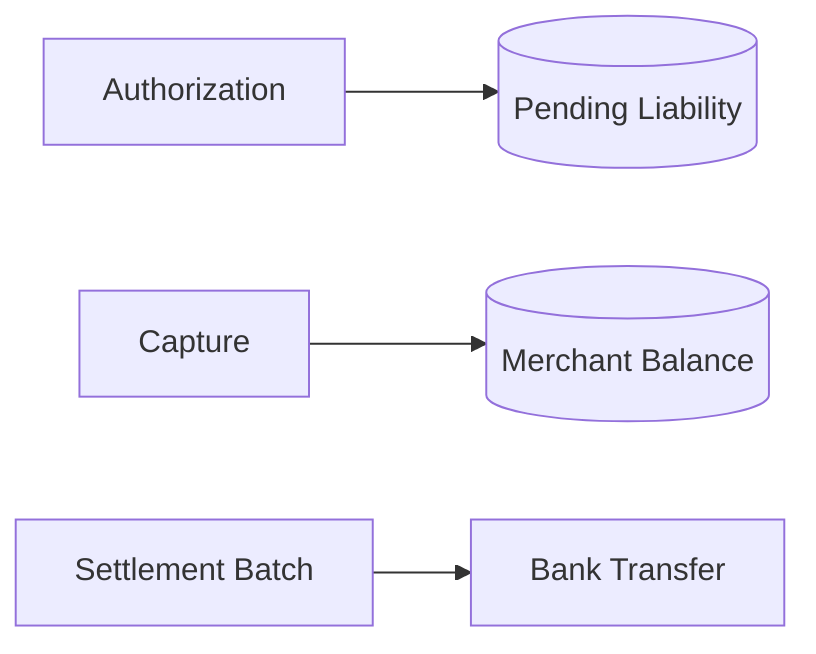
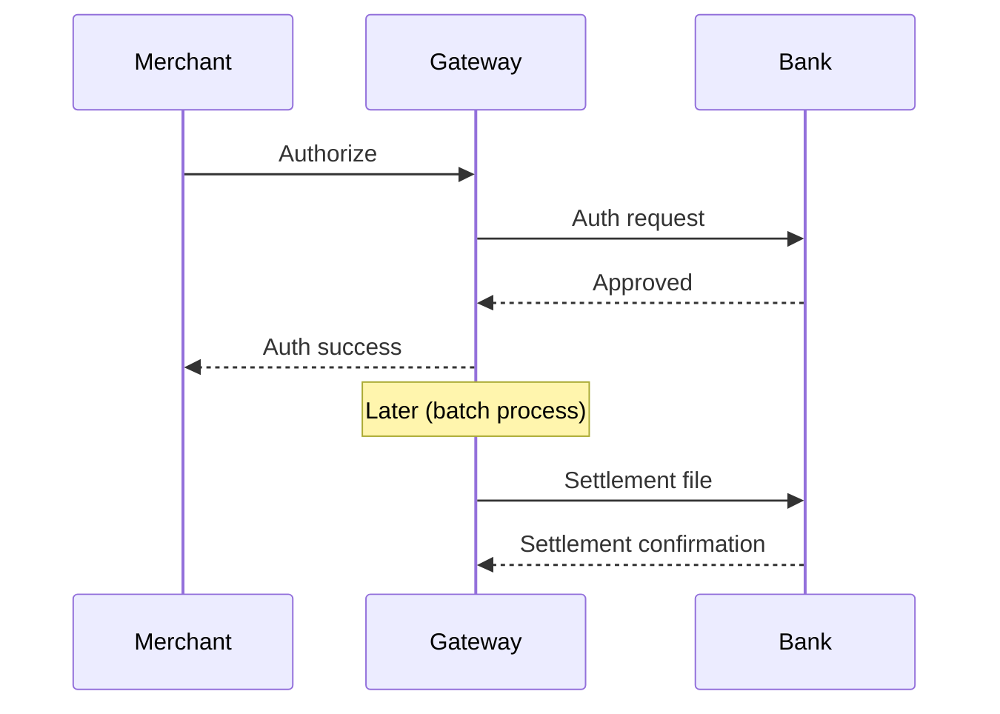
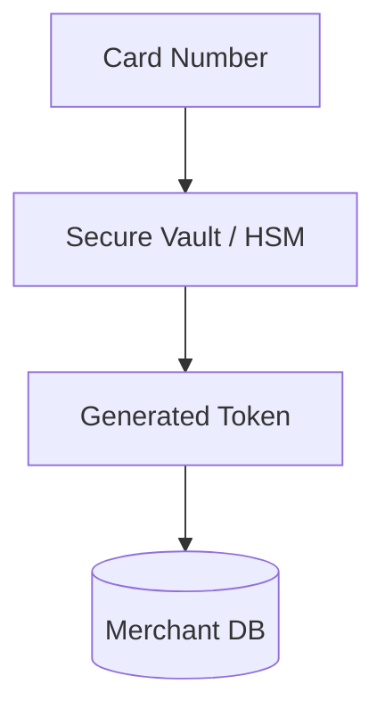
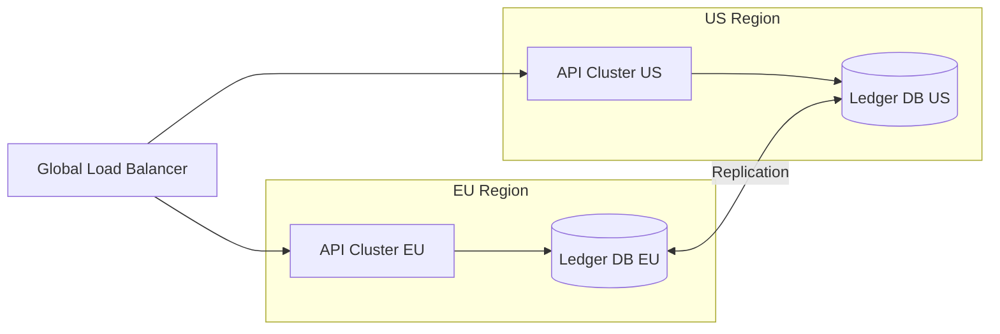
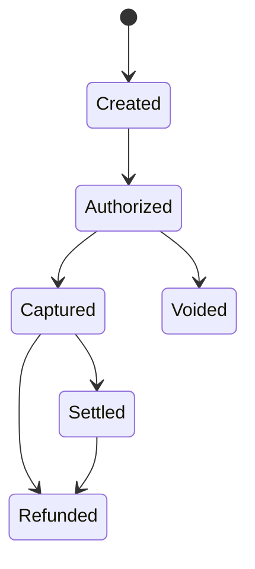
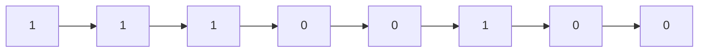

Online payments look simple.

<p>
  <center>Click → approve → success.</center>
</p>

Behind that button sits a distributed, cryptographically hardened, regulation-bound financial system. Companies like **Stripe** abstract this complexity away, but the underlying architecture is fascinating — and demanding.

> **TL;DR** — A payment gateway orchestrates the flow between merchants, acquiring banks, card networks (Visa/Mastercard), and issuing banks. It must handle **idempotency** (no double charges), **fraud scoring**, **PCI-compliant tokenization** (card numbers never touch merchant servers), and **double-entry ledger accounting** — all in ~200 ms. Messages between banks travel as **ISO 8583** binary frames driven by bitmaps, not JSON. The standard was recently updated to **ISO 8583:2023**, replacing the 1987/1993 editions to fix ambiguity, support modern payment types (e-commerce, mobile wallets, contactless), and align with ISO 20022. Settlement happens asynchronously in batches, and the whole system must survive multi-region failures without ever losing money or auditability.

This post covers:

- System design architecture
- Component and sequence diagrams (Mermaid)
- Idempotency and failure handling
- Ledger and settlement design
- PCI compliance and tokenization
- Scaling and multi-region challenges
- Deep dive into ISO 8583 message structure and bitmaps
- ISO 8583:2023 — what changed and why

## High-Level System Architecture

At a high level, a payment gateway connects customers, merchants, banks, and card networks.



### How It Fits Together

The **orchestrator** is the brain. Everything flows through it. It coordinates the interaction between internal services — fraud checks, tokenization lookups, ledger writes — before issuing outbound calls to acquiring banks and card networks. Think of it as a saga coordinator: it ensures that each step in the payment lifecycle completes in the correct order, and triggers compensating actions (e.g., reversals) when something fails partway through.

Key roles of each component:

| Component                     | Responsibility                                                                                                                                                                 |
| ----------------------------- | ------------------------------------------------------------------------------------------------------------------------------------------------------------------------------ |
| **API Gateway**               | Rate limiting, TLS termination, routing                                                                                                                                        |
| **Auth Service**              | Merchant authentication, API key validation                                                                                                                                    |
| **Payment Orchestrator**      | Coordinates the end-to-end payment flow                                                                                                                                        |
| **Idempotency Layer**         | Deduplicates retried requests                                                                                                                                                  |
| **Fraud Engine**              | Scores transactions for risk (rules + ML models)                                                                                                                               |
| **Tokenization Vault**        | Replaces PANs with opaque tokens ([PCI DSS](https://www.pcisecuritystandards.org/) scope reduction)                                                                            |
| **Ledger Service**            | Immutable, double-entry accounting records                                                                                                                                     |
| **Settlement Service**        | Batches captured transactions for bank settlement                                                                                                                              |
| **Bank & Network Connectors** | Protocol adapters (ISO 8583, proprietary APIs) for acquirers and card networks like [Visa](https://developer.visa.com/), [Mastercard](https://developer.mastercard.com/), etc. |

## Payment Authorization Sequence

A successful authorization involves multiple institutions.



Notice ordering discipline:

1. Idempotency check
2. Fraud evaluation
3. External call
4. Ledger write

You never persist success before the bank confirms it.

## Idempotency: Preventing Double Charges

Distributed systems retry. Users refresh. Networks fail.

Without idempotency, double charges are inevitable.



The gateway stores the response against a unique key (typically the `Idempotency-Key` header provided by the merchant). Replays return the same stored result without re-executing the payment.

### Implementation Considerations

- **Key format**: Usually a UUID or merchant-generated unique reference. [Stripe](https://stripe.com/docs/api/idempotent_requests), for example, accepts an `Idempotency-Key` header on every `POST` request.
- **Storage**: A fast key-value store (e.g., Redis) works well, with a TTL of 24–72 hours to prevent unbounded growth.
- **Atomicity**: The check-and-store operation must be atomic — typically achieved with `SETNX` (set-if-not-exists) semantics or a database unique constraint.
- **Scope**: The idempotency key should be scoped to the merchant + operation. Two different merchants using the same key should not collide.
- **Response caching**: Store the full HTTP response (status code, headers, body) so replayed requests are indistinguishable from the original.

This is not optional in financial systems. Without it, network retries and user double-clicks become double charges — the fastest way to lose merchant trust.

## Ledger Design: Double-Entry Accounting

Money requires strong consistency and auditability.



### Principles

- **Append-only ledger**: Entries are never updated or deleted. Every state change is a new record.
- **Immutable entries**: Once written, a ledger entry cannot be modified. If a correction is needed, a new compensating entry is written.
- **Double-entry bookkeeping**: Every transaction creates at least two entries — a debit and a credit — that must balance to zero. For example, when a payment is captured, the merchant's balance is credited and the settlement liability account is debited.
- **Compensating transactions for refunds**: A refund doesn't delete the original charge; it creates a reverse entry.
- **No silent mutation of balances**: Balances are always derived by replaying or aggregating ledger entries, never stored as a mutable counter.

This is how banks have worked for centuries. [Event sourcing](https://martinfowler.com/eaaDev/EventSourcing.html) — where the application state is derived from an append-only log of events — aligns beautifully with this model. The ledger _is_ the event log.

## Authorization vs Settlement

Authorization is synchronous. Settlement is asynchronous.



This separation:

- Reduces banking overhead (fewer real-time round trips)
- Improves throughput (batch file transfer is more efficient than per-transaction settlement)
- Enables reconciliation cycles (merchants and acquirers can compare expected vs. actual settlement amounts)

Settlement typically occurs via settlement files exchanged in formats agreed between the gateway and the acquiring bank (often ISO 8583-based batches, or increasingly, [ISO 20022](https://www.iso20022.org/) `pacs` messages).

## Tokenization and PCI Scope Reduction

[PCI DSS](https://www.pcisecuritystandards.org/document_library/) compliance governs cardholder data handling. The current version, **PCI DSS v4.0.1** (published June 2024), introduced significant changes including stronger authentication requirements, expanded encryption mandates, and a focus on continuous security processes rather than point-in-time assessments. Compliance is enforced by the card networks (Visa, Mastercard, etc.) and validated through Qualified Security Assessors (QSAs) or Self-Assessment Questionnaires (SAQs).

Tokenization reduces exposure.



Raw PAN never touches merchant infrastructure. The merchant only ever stores and transmits the token; the actual card number lives in the PCI-compliant vault, typically backed by a [Hardware Security Module (HSM)](https://en.wikipedia.org/wiki/Hardware_security_module).

Security measures typically include:

- **TLS 1.2+** in transit (TLS 1.3 preferred) — [IETF RFC 8446](https://datatracker.ietf.org/doc/html/rfc8446)
- **AES-256 encryption** at rest
- **Hardware Security Modules (HSMs)** for cryptographic key management and PIN block operations
- **Strict network segmentation** — the Cardholder Data Environment (CDE) must be isolated from the rest of the network
- **Logging & monitoring** — all access to cardholder data must be logged and regularly reviewed

## Multi-Region Deployment

Global providers must tolerate regional failures.



Challenges:

- **Cross-region consistency**: Distributed databases must choose between strong consistency and availability ([CAP theorem](https://en.wikipedia.org/wiki/CAP_theorem)). Payment ledgers typically favor consistency.
- **Data residency laws**: Regulations like [GDPR](https://gdpr.eu/) (EU), [DPDPA](https://www.meity.gov.in/data-protection-framework) (India), and [LGPD](https://www.gov.br/esporte/pt-br/acesso-a-informacao/lgpd) (Brazil) may require cardholder data to be stored within specific geographic boundaries.
- **Idempotency across regions**: If a request is retried against a different region during failover, the idempotency store must be globally accessible or the failover must be sticky.
- **Failover correctness**: Active-passive vs. active-active topologies each bring trade-offs. Active-active risks split-brain; active-passive risks downtime during switchover.

Money cannot tolerate split-brain states.

## Payment State Machine

Payments follow strict state transitions.



State machines prevent invalid flows like capturing twice or refunding before capture.

## Deep Dive: ISO 8583

Now we descend into the ancient machinery that powers card networks.

[ISO 8583](https://en.wikipedia.org/wiki/ISO_8583) is the messaging standard used by most card networks to transmit transaction data. Developed by the ISO under [Technical Committee 68 (Financial Services)](https://www.iso.org/committee/49650.html), it has been the backbone of card-based payments globally.

It is not JSON.<br />
It is not REST.<br />
It is field-based, positional, bitmap-driven binary messaging!

It was born in the 1980s and still runs global commerce.

---

### Structure of an ISO 8583 Message

An ISO 8583 message typically contains:

1. Message Type Indicator (MTI)
2. Primary Bitmap (64 bits)
3. Secondary Bitmap (optional)
4. Data Elements (fields)

Conceptually:

```
[ MTI ][ Bitmap ][ Data Elements... ]
```

### Message Type Indicator (MTI)

MTI is 4 digits. Each digit encodes a specific dimension of the message:

| Position  | Meaning              | Values                                                                                                       |
| --------- | -------------------- | ------------------------------------------------------------------------------------------------------------ |
| 1st digit | **Version**          | `0` = ISO 8583:1987, `1` = ISO 8583:1993, `2` = ISO 8583:2003/2023                                           |
| 2nd digit | **Message Class**    | `1` = Authorization, `2` = Financial, `3` = File Action, `4` = Reversal/Chargeback, `8` = Network Management |
| 3rd digit | **Message Function** | `0` = Request, `1` = Response, `2` = Advice, `3` = Advice Response                                           |
| 4th digit | **Message Origin**   | `0` = Acquirer, `1` = Acquirer Repeat, `2` = Issuer, `3` = Issuer Repeat                                     |

Example:

```
0100  → Authorization Request
0110  → Authorization Response
0200  → Financial Transaction Request
0210  → Financial Transaction Response
```

Each digit has meaning:

- Version
- Message class
- Message function
- Message origin

It’s compact and brutally efficient.

### Bitmaps: The Heart of ISO 8583

The primary bitmap is a 64-bit (8-byte) field, typically transmitted as 16 hex characters.

Each bit corresponds to a data element (DE). If a bit is set (1), the corresponding data element is present in the message.

#### Worked Example

Suppose the primary bitmap in hex is:

```
F2 3C 44 81 08 E0 80 00
```

Converting each hex nibble to binary:

```
F    2    3    C    4    4    8    1    0    8    E    0    8    0    0    0
1111 0010 0011 1100 0100 0100 1000 0001 0000 1000 1110 0000 1000 0000 0000 0000
```

Reading left to right, bit positions 1–64:

- **Bit 1 = 1** → Secondary bitmap is present (fields 65–128 follow)
- **Bit 2 = 1** → DE 2 (Primary Account Number) is present
- **Bit 3 = 1** → DE 3 (Processing Code) is present
- **Bit 4 = 1** → DE 4 (Transaction Amount) is present
- **Bit 5 = 0** → DE 5 not present
- ... and so on for all 64 bit positions

This bitmap tells the parser exactly which fields to expect and in what order — no field labels, no delimiters, no ambiguity.

Conceptual visualization of the first 8 bits:



If bit 1 is 1, a secondary bitmap follows (fields 65–128).

Think of it as a presence map.

Instead of sending field labels, the message uses bit positions to indicate which fields exist. That’s bandwidth-efficient and deterministic.

### Example Fields

Common data elements:

| DE  | Name                             | Format       | Description                                                                                           |
| --- | -------------------------------- | ------------ | ----------------------------------------------------------------------------------------------------- |
| 2   | Primary Account Number (PAN)     | LLVAR, n..19 | The card number                                                                                       |
| 3   | Processing Code                  | Fixed, n 6   | Identifies the transaction type (purchase, refund, balance inquiry, etc.)                             |
| 4   | Transaction Amount               | Fixed, n 12  | Amount in minor units (e.g., cents)                                                                   |
| 7   | Transmission Date & Time         | Fixed, n 10  | MMDDhhmmss — when the message was sent                                                                |
| 11  | System Trace Audit Number (STAN) | Fixed, n 6   | Unique trace number for the transaction                                                               |
| 37  | Retrieval Reference Number       | Fixed, an 12 | Used to link request and response across networks                                                     |
| 38  | Authorization ID Response        | Fixed, an 6  | Code assigned by the authorizing institution                                                          |
| 39  | Response Code                    | Fixed, an 2  | `00` = Approved, `05` = Do Not Honour, `51` = Insufficient Funds, etc.                                |
| 41  | Card Acceptor Terminal ID        | Fixed, ans 8 | Identifies the terminal at the point of sale                                                          |
| 49  | Transaction Currency Code        | Fixed, n 3   | [ISO 4217](https://en.wikipedia.org/wiki/ISO_4217) currency code (e.g., `840` for USD, `978` for EUR) |

For the full list of data elements, see the [ISO 8583 Wikipedia reference](https://en.wikipedia.org/wiki/ISO_8583#Data_elements).

Example simplified flow:

Authorization request (0100):

- PAN
- Amount
- STAN
- Timestamp

Authorization response (0110):

- Same STAN
- Response Code (00 = Approved)

### Why Bitmaps Matter

Bitmaps allow:

- Compact binary messaging
- Deterministic parsing
- Flexible field combinations
- Backward compatibility

Parsing algorithm:

1. Read MTI
2. Read primary bitmap
3. If bit 1 = 1 → read secondary bitmap
4. Iterate through bits
5. For each set bit → parse corresponding field in order

No field names. No delimiters. Just positional discipline.

Elegant. Severe. Efficient.

## Engineering Challenges with ISO 8583

- **Variable-length fields (LLVAR, LLLVAR)**: Not all fields are fixed-width. `LLVAR` fields are prefixed with a 2-digit length indicator (max 99 bytes), while `LLLVAR` fields use a 3-digit prefix (max 999 bytes). For example, Field 2 (PAN) is `LLVAR` because card numbers vary from 13 to 19 digits — the first 2 bytes tell you how many digits follow. The parser must read the length prefix _before_ reading the field value, making the parsing inherently sequential within the data elements section.
- **Network-specific custom fields**: Fields 48–62 and 112–128 are commonly reserved for private (network-specific) use. Visa, Mastercard, and regional networks each define their own sub-field layouts within these ranges, so a single ISO 8583 parser rarely works across all networks without customization.
- **Different implementations per network**: Even core fields can differ in format across implementations. What passes validation at one acquirer may be rejected by another.
- **Strict formatting rules**: Numeric fields (`n`), alphanumeric (`an`), and alphanumeric-special (`ans`) each have precise character set rules. Padding (leading zeros for numeric, trailing spaces for alpha) must be exact.
- **Message signing / MAC validation**: Integrity is ensured via a Message Authentication Code (MAC), typically using [ANSI X9.19](https://en.wikipedia.org/wiki/ISO/IEC_9797-1) or [ISO 9797-1](https://www.iso.org/standard/50375.html). The MAC is computed over the message content and appended as a data element (commonly DE 64 or DE 128).
- **Timeout and reversal handling**: If the acquirer doesn't respond within the timeout window (typically 30–60 seconds), the gateway must send a reversal (MTI `04xx`) to avoid orphaned authorizations that lock up the cardholder's available balance.

Gateways often build adapter layers:

```
Internal JSON → ISO 8583 mapper → Network-specific variant
```

It is a protocol translation engine under strict latency budgets (often < 100ms for the mapping itself).

## ISO 8583:2023 — The New Standard

In 2023, ISO published a new edition of the standard: **ISO 8583:2023** — _"Financial-transaction card-originated messages — Interchange message specifications"_. This edition **withdrew and replaced** all prior versions, including the widely-implemented ISO 8583:1987 and ISO 8583:1993.

You can view the official catalogue entry at [iso.org/standard/79451.html](https://www.iso.org/standard/79451.html).

### Why Were the Older Standards Withdrawn?

The previous editions had served the industry for decades, but several long-standing issues motivated the revision:

1. **Ambiguity and divergent interpretation**: The older editions left many data element definitions open to interpretation. Different card networks, acquirers, and regional processors evolved their own "flavors" of ISO 8583, creating interoperability friction. A message valid on one network could be rejected by another — not because of a logical error, but because of formatting disagreement.

2. **Security gaps**: The original standards were designed in an era before modern threat models. They lacked adequate provisions for stronger cryptographic controls, tokenization, and the secure handling of sensitive authentication data that contemporary regulations demand.

3. **Inability to express modern payment types**: E-commerce, mobile wallets, contactless payments, QR codes, and 3-D Secure flows introduced data requirements that didn't fit neatly into the original field structures. Networks resorted to stuffing sub-fields into private-use data elements (DE 48–62, DE 112–128), leading to fragmentation.

4. **Regulatory evolution**: Regulations like [PSD2](https://eur-lex.europa.eu/legal-content/EN/TXT/?uri=celex%3A32015L2366) (EU), [RBI tokenization mandates](https://www.rbi.org.in/Scripts/NotificationUser.aspx?Id=12159) (India), and [PCI DSS v4.0](https://www.pcisecuritystandards.org/document_library/) imposed new data exchange requirements that older editions could not accommodate cleanly.

5. **ISO's systematic review process**: ISO standards are subject to periodic review. When a standard no longer reflects current best practice or industry need, it is revised or withdrawn. The older ISO 8583 editions were overdue for consolidation.

### What Changed in ISO 8583:2023?

The 2023 edition is a significant restructuring, not merely an errata update:

| Aspect                       | Older Editions                                           | ISO 8583:2023                                                                                                                                         |
| ---------------------------- | -------------------------------------------------------- | ----------------------------------------------------------------------------------------------------------------------------------------------------- |
| **Structure**                | Split across multiple parts with overlapping scope       | Consolidated into a single, coherent document                                                                                                         |
| **Data element definitions** | Often ambiguous; heavy reliance on implementation guides | Clearer, more prescriptive definitions to reduce divergence                                                                                           |
| **Modern payment support**   | Retrofitted via private-use fields                       | Native support for e-commerce, mobile, and tokenized transactions                                                                                     |
| **Security provisions**      | Minimal; delegated to external standards                 | Enhanced alignment with modern cryptographic and authentication requirements                                                                          |
| **Extensibility**            | Ad-hoc network-specific extensions                       | More structured approach to extensions and private-use data                                                                                           |
| **Alignment with ISO 20022** | No formal alignment                                      | Improved conceptual alignment with [ISO 20022](https://www.iso20022.org/) messaging, facilitating coexistence during the industry's gradual migration |

Key technical changes include:

- **Revised data element numbering and definitions**: Some fields were redefined, merged, or deprecated to eliminate legacy ambiguity.
- **Improved sub-field structures**: Better-defined nested data within composite fields, reducing the reliance on ad-hoc parsing conventions.
- **Enhanced MTI semantics**: Clearer rules for version, message class, function, and origin encoding.
- **Forward-compatibility provisions**: The specification anticipates future payment types and authentication mechanisms.

### Migration Reality

Despite the new standard, the vast majority of live payment networks still run on ISO 8583:1987- or 1993-based profiles. Migration to the 2023 edition will be gradual, driven by individual network upgrade cycles, regulatory mandates, and processor readiness. Many networks may skip directly to [ISO 20022](https://www.iso20022.org/) for new implementations, using ISO 8583:2023 primarily as a reference for maintaining legacy interoperability.

> **More about ISO 8583:2023**
>
> - ISO catalogue: [ISO 8583:2023](https://www.iso.org/standard/79451.html)
> - ISO TC68 committee: [Technical Committee 68](https://www.iso.org/committee/49650.html)
> - Wikipedia overview: [ISO 8583](https://en.wikipedia.org/wiki/ISO_8583)
> - ISO 20022 (the newer messaging paradigm): [iso20022.org](https://www.iso20022.org/)

## Why Payment Systems Are So Complex

They combine:

- Distributed systems theory
- Cryptography
- Accounting principles
- Regulatory compliance
- Protocol engineering
- Real-time fraud modeling

They must:

- Never double-charge
- Never lose money
- Never lose auditability
- Never expose card data
- Never go down

And do it in ~200 milliseconds!

That’s not “just an API.” That’s modern civilization’s circulatory system.

---

If you'd like, the next step could be:

- Designing a simplified payment gateway using Spring Boot and event-driven architecture
- Modeling a mini ISO 8583 parser in Java
- Or exploring **ISO 20022** and real-time payment rails (UPI, FedNow, SEPA Instant)

Because once you understand payment systems, you start seeing how digital trust is actually engineered — not assumed! Give it a try...

---

## Further Reading

- [ISO 8583:2023 — Official ISO Catalogue Entry](https://www.iso.org/standard/79451.html)
- [ISO 20022 — Universal financial industry message scheme](https://www.iso20022.org/)
- [PCI DSS Document Library](https://www.pcisecuritystandards.org/document_library/)
- [Stripe: How payments work](https://stripe.com/docs/payments)
- [Visa Developer Platform](https://developer.visa.com/)
- [Mastercard Developers](https://developer.mastercard.com/)
- [Martin Fowler: Event Sourcing](https://martinfowler.com/eaaDev/EventSourcing.html)
- [Wikipedia: ISO 8583](https://en.wikipedia.org/wiki/ISO_8583)
- [IETF RFC 8446 — TLS 1.3](https://datatracker.ietf.org/doc/html/rfc8446)
